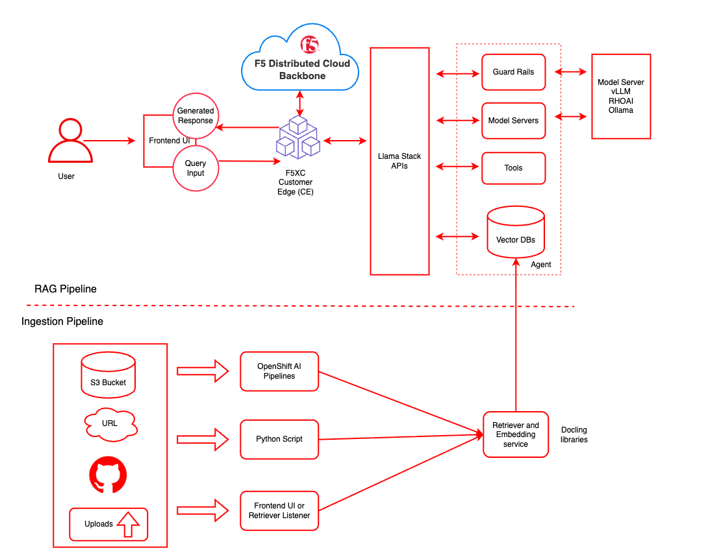

# Securing Model Inference with F5 Distributed Cloud API Security

<!-- CONTRIBUTOR TODO: update title ^^

*replace the H1 title above with your quickstart title*

TITLE requirements:
	* MAX CHAR: 64 
	* Industry use case, ie: Protect patient data with LLM guardrails

TITLE will be extracted for publication.

-- > 


<!-- CONTRIBUTOR TODO: short description 

*ADD a SHORT DESCRIPTION of your use case between H1 title and next section*

SHORT DESCRIPTION requirements:
	* MAX CHAR: 160
	* Describe the INDUSTRY use case 

SHORT DESCRIPTION will be extracted for publication.

--> 


## Table of contents

<!-- Table of contents is optional, but recommended. 

REMEMBER: to remove this section if you don't use a TOC.

-->

## Detailed description

This QuickStart shows how to protect AI inference endpoints on Red Hat OpenShift AI using F5 Distributed Cloud (XC) Web App & API Protection (WAAP) + API Security. You’ll deploy a KServe/vLLM model service in OpenShift AI, front it with an F5 XC HTTP Load Balancer, and enforce API discovery, OpenAPI schema validation, rate limiting, bot defense, and sensitive-data controls—without changing your ML workflow. OpenShift AI’s single-model serving is KServe-based (recommended for LLMs), and KServe’s HuggingFace/vLLM runtime exposes OpenAI-compatible endpoints, which we’ll secure via F5 XC

Key Components

- Red Hat OpenShift AI – Unified MLOps platform for developing and inference models at scale.
- F5 Distributed Cloud API Security – Provides LLM-aware threat detection, schema validation, and sensitive data redaction.
- Integration Blueprint – Demonstrates secure model inference across hybrid environments


### See it in action 

<!-- 

*This section is optional but recommended*

Arcades are a great way to showcase your quickstart before installation.

-->

### Architecture diagrams


| Layer/Component | Technology | Purpose/Description |
|-----------------|------------|---------------------|
| **Orchestration** | OpenShift AI | Container orchestration and GPU acceleration |
| **Framework** | LLaMA Stack | Standardizes core building blocks and simplifies AI application development |
| **UI Layer** | Streamlit | User-friendly chatbot interface for chat-based interaction |
| **LLM** | Llama-3.2-3B-Instruct | Generates contextual responses based on retrieved documents |
| **Embedding** | all-MiniLM-L6-v2 | Converts text to vector embeddings |
| **Vector DB** | PostgreSQL + PGVector | Stores embeddings and enables semantic search |
| **Retrieval** | Vector Search | Retrieves relevant documents based on query similarity |
| **Storage** | S3 Bucket | Document source for enterprise content |


## Requirements


### Minimum hardware requirements 

<!-- CONTRIBUTOR TODO: add minimum hardware requirements

*Section is required.* 

Be as specific as possible. DON'T say "GPU". Be specific.

List minimum hardware requirements.

--> 

### Minimum software requirements

- OpenShift Client CLI - [oc](https://docs.redhat.com/en/documentation/openshift_container_platform/4.18/html/cli_tools/openshift-cli-oc#installing-openshift-cli)
- OpenShift Cluster 4.18+
- OpenShift AI
- Helm CLI - helm


### Required user permissions

- Regular user permission for default deployment
- Cluster admin required for *advanced* configurations


## Deploy

*The instructions below will deploy this quickstart to your OpenShift environment.*

*Please see the [local deployments](#local-deployment) section for additional deployment options.* 

### Prerequisites
- [huggingface-cli](https://huggingface.co/docs/huggingface_hub/guides/cli) (optional)
- [Hugging Face Token](https://huggingface.co/settings/tokens)
- Access to [Meta Llama](https://huggingface.co/meta-llama/Llama-3.2-3B-Instruct/) model
- Access to [Meta Llama Guard](https://huggingface.co/meta-llama/Llama-Guard-3-8B/) model
- Some of the example scripts use `jq` a JSON parsing utility which you can acquire via `brew install jq`

### Supported Models

| Function    | Model Name                             | Hardware    | AWS
|-------------|----------------------------------------|-------------|-------------
| Embedding   | `all-MiniLM-L6-v2`                     | CPU/GPU/HPU |
| Generation  | `meta-llama/Llama-3.2-3B-Instruct`     | L4/HPU      | g6.2xlarge
| Generation  | `meta-llama/Llama-3.1-8B-Instruct`     | L4/HPU      | g6.2xlarge
| Generation  | `meta-llama/Meta-Llama-3-70B-Instruct` | A100 x2/HPU | p4d.24xlarge
| Safety      | `meta-llama/Llama-Guard-3-8B`          | L4/HPU      | g6.2xlarge

Note: the 70B model is NOT required for initial testing of this example. The safety/shield model `Llama-Guard-3-8B` is also optional.

### Installation Steps

1. **Clone Repository**

```bash
git clone https://github.com/rh-ai-quickstart/RAG
```

2. **Login to OpenShift**

```bash
oc login --server="<cluster-api-endpoint>" --token="sha256~XYZ"
```


### Delete

<!-- CONTRIBUTOR TODO: add uninstall instructions

*Section required. Include explicit steps to cleanup quickstart.*

Some users may need to reclaim space by removing this quickstart. Make it easy.

-->

## References 

<!-- 

*Section optional.* Remember to remove if do not use.

Include links to supporting information, documentation, or learning materials.

--> 

## Technical details

<!-- 

*Section is optional.* 

Here is your chance to share technical details. 

Welcome to add sections as needed. Keep additions as structured and consistent as possible.

-->

## Tags

<!-- CONTRIBUTOR TODO: add metadata and tags for publication

TAG requirements: 
	* Title: max char: 64, describes quickstart (match H1 heading) 
	* Description: max char: 160, match SHORT DESCRIPTION above
	* Industry: target industry, ie. Healthcare OR Financial Services
	* Product: list primary product, ie. OpenShift AI OR OpenShift OR RHEL 
	* Use case: use case descriptor, ie. security, automation, 
	* Contributor org: defaults to Red Hat unless partner or community
	
Additional MIST tags, populated by web team.

-->
